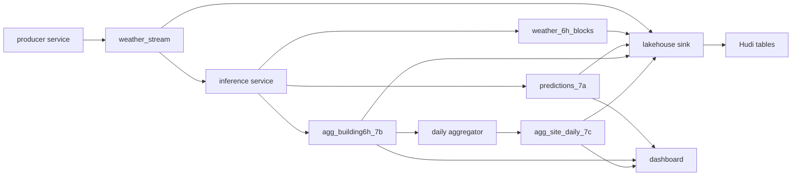

# A2B Production Streaming Pipeline

This folder contains a production-style version of the A2B streaming inference workflow. It is separate from the notebook implementation in `../A2B` and does not require Jupyter.

The pipeline uses Kafka, Spark Structured Streaming, the saved Spark ML model from `../A2A/models/gbt_best_model`, Hudi Merge-on-Read tables, and a small FastAPI dashboard with built-in canvas charts.

## Architecture



The important design difference from the notebook version is that inference does not read or write Hudi state in the live scoring path. It parses the current Kafka micro-batch, builds complete 6-hour weather blocks, scores the model, and sends Kafka results immediately. A separate lakehouse sink consumes Kafka topics and upserts every record into Hudi asynchronously, so Hudi can lag without blocking the dashboard.

## Folder Structure

```text
A2B_production/
|-- configs/local.yaml
|-- docker-compose.yml
|-- docker/Dockerfile
|-- runtime/
|-- src/a2b_production/
|   |-- cli.py
|   |-- producer.py
|   |-- inference.py
|   |-- daily_aggregator.py
|   |-- lakehouse_sink.py
|   |-- dashboard.py
|   |-- monitor.py
|   |-- validate.py
|   `-- transforms.py
`-- tests/
```

## Run Locally With Docker

From this folder:

```bash
cd A2B_production
docker compose build app
docker compose up -d kafka zookeeper
docker compose run --rm app a2b-prod create-topics
```

Start the full streaming stack:

```bash
docker compose --profile pipeline --profile dashboard up -d
```

The `producer` service streams every row from `../A2A/weather_transf.csv` in source timestamp order. Weather records are sent to Kafka partition `site_id`, so `weather_stream` should have 16 partitions for the 16 sites. It exits only after the full weather source has been sent.

Producer pacing is controlled in `configs/local.yaml` with `producer_ticks_per_batch` and `producer_tick_sleep_seconds`. A tick is one source weather timestamp.

Open the dashboard:

```text
http://localhost:8080
```

The dashboard shows one selected site at a time. Use the site selector for site-level daily charts and the building selector for the 6-hour building prediction chart.

Check health and offsets:

```bash
docker compose run --rm app a2b-prod monitor
docker compose run --rm app a2b-prod validate-outputs
```

Stop everything:

```bash
docker compose down
```

Clean only this production runtime state:

```bash
docker compose run --rm app a2b-prod clean-runtime
```

If `weather_stream` was previously created with fewer than 16 partitions, reset Kafka before a deterministic site-partitioned run:

```bash
docker compose --profile pipeline --profile dashboard down
docker compose down -v
docker compose up -d kafka zookeeper
docker compose run --rm app a2b-prod create-topics
```

## Topic Contracts

- `weather_stream`: hourly weather JSON keyed by `site-{site_id}`.
- `weather_6h_blocks`: complete 6-hour site weather aggregates keyed by `site_id|date|hour_block`.
- `predictions_7a`: building/date/hour-block prediction rows keyed by `record_key`.
- `agg_building6h_7b`: one row per `building_id/date/hour_block`.
- `agg_site_daily_7c`: one row per site and date, updated as more building blocks arrive.

Stable keys make duplicate Kafka delivery safe for downstream consumers.

## Hudi Tables

Hudi tables are stored under `runtime/hudi`:

- `bronze_weather_hourly`
- `silver_weather_6h`
- `gold_predictions_7a`
- `gold_building_6h_7b`
- `gold_site_daily_7c`

Tables use Merge-on-Read and are partitioned by `site_id`. The `date` field remains in each record for filtering and comparison without creating one folder per site/day pair.

The `lakehouse-sink` service writes these tables from Kafka with Hudi async compaction enabled. Live analytics come from Kafka topics, so Hudi write or compaction lag should not slow inference, daily aggregation, or the dashboard.

## Tests

Run unit tests inside the production image:

```bash
docker compose run --rm app pytest -q
```

Run a short smoke workflow:

```bash
docker compose run --rm app a2b-prod validate-config
docker compose run --rm app a2b-prod create-topics
docker compose --profile pipeline --profile dashboard up -d
docker compose run --rm app a2b-prod monitor
```

## Troubleshooting

- If no output appears, run `a2b-prod monitor` and check whether `weather_stream` offsets are increasing across site partitions.
- If `weather_stream` offsets stop increasing, check the `producer` service status and `runtime/producer_state.json`.
- If `weather_stream` is far ahead of `predictions_7a`, inference is catching up from Kafka backlog.
- If Kafka output topics are advancing but Hudi tables are not, check the `lakehouse-sink` service logs and `runtime/checkpoints/lakehouse/`.
- If `agg_site_daily_7c` is empty, confirm `agg_building6h_7b` is receiving records first.
- If the model fails to load, rerun the A2A notebook to recreate `../A2A/models/gbt_best_model`.
- If a replay is needed, change `streaming.run_mode` to `replay` in `configs/local.yaml`, clean runtime, and restart services.
